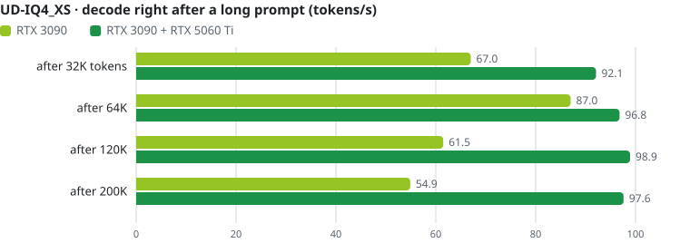
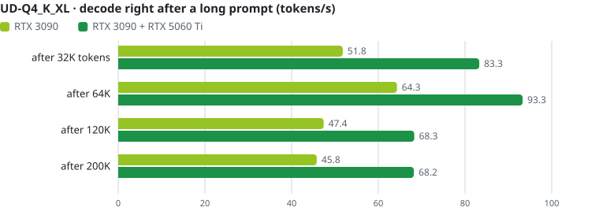
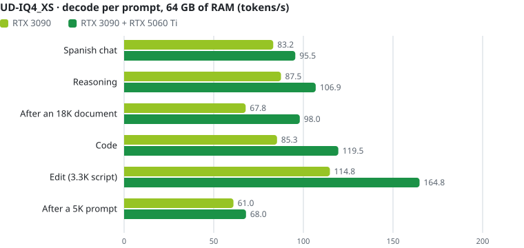
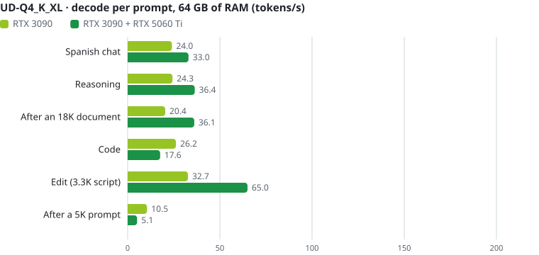
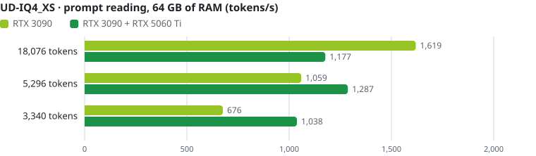
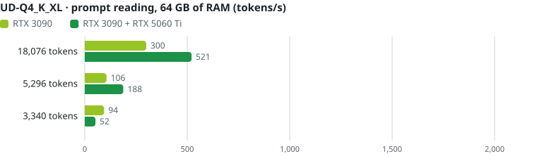

<h1 align="center">Strata on a Ryzen 7 5700X + RTX 3090 + RTX 5060 Ti</h1>

<b>Qwen3.8-Flash-Next 125B (MoE) on a desktop PC: 93 tokens/s on one RTX 3090, 116 tokens/s with an RTX 5060 Ti beside it</b> 
unsloth UD-IQ4_XS and UD-Q4_K_XL · 128 GB DDR4 · Linux · <a href="README.es.md">en español</a>

This is [eddoursul/Strata](https://github.com/eddoursul/Strata)'s `custom` branch, a fork of
[Niko1221/Strata](https://github.com/Niko1221/Strata) tuned for an RTX 3090 with a second card as an expert tier,
plus a few fixes and some of upstream's newer engine changes (among them 0.1.40's elastic K/V cache), measured on one
machine with one GPU and with two.
The original Strata README (what Strata is, setup, every option) is in [STRATA-README.md](STRATA-README.md).

<picture>
  <source media="(prefers-color-scheme: dark)" srcset="docs/media/readme/summary-dark.svg">
  
</picture>

| Decode, tokens/s | RTX 3090 | RTX 3090 + RTX 5060 Ti | with the second GPU |
|---|---:|---:|---:|
| UD-IQ4_XS | **92.9** | **116.3** | +25% |
| UD-Q4_K_XL | **71.2** | **84.9** | +19% |

## The machine

| | |
|---|---|
| CPU | AMD Ryzen 7 5700X: 8 cores / 16 threads, Zen 3, AVX2 (no AVX-512) |
| RAM | 128 GB DDR4-3200 CL22 (4 x 32 GB), ~36 GB/s read (STREAM) |
| Main GPU | NVIDIA RTX 3090 24 GB, PCIe 4.0 x8, power limit 250 W |
| Second GPU (expert tier) | NVIDIA RTX 5060 Ti 16 GB, PCIe 4.0 x8, power limit 150 W |
| Disk | NVMe, Crucial P3 Plus 2 TB |
| Software | Linux (kernel 7.2), NVIDIA driver 615.71, CUDA 13.4, engine built for `86;120` |

At the cards' stock limits (350 W and 180 W) the speeds were the same: the engine is bound by the CPU, the RAM and
PCIe, not by the GPUs' power.

## The models

Qwen3.8-Flash-Next has 48 layers of 512 routed experts. Strata keeps the experts in RAM, keeps the most used ones in
VRAM (an adaptive cache) and computes the rest on the CPU, so the RAM, the CPU and the PCIe link all set the speed.

| | UD-IQ4_XS | UD-Q4_K_XL |
|---|---|---|
| unsloth GGUF files | 3 | 4 |
| Expert weights | 55.4 GiB | 71.7 GiB |
| Expert formats (gate/up · down) | IQ3_S (47 layers), IQ4_XS (1) · IQ4_NL (43), Q8_0 (5) | Q4_K (47), Q5_K (1) · Q5_1 (43), Q8_0 (5) |
| RAM taken by the engine | ~58 GiB | ~81 GB |
| The CPU's expert kernels | compute-bound: they scale with cores | bandwidth-bound: DDR4 saturates at ~4 cores |

Both run with 200,192 tokens of context, an int8 KV cache that takes VRAM only as a conversation grows (`--kv-grow`:
until then the expert cache holds ~1,000 more experts), the MTP draft layer with a Spanish draft vocabulary plus prompt
lookup, and greedy verification: the speculation never changes the output.

## One GPU or two

The RTX 5060 Ti holds ~14.5 GB more experts and computes its share of each layer while the CPU computes its own.

<picture>
  <source media="(prefers-color-scheme: dark)" srcset="docs/media/readme/decode-iq4xs-dark.svg">
  
</picture>

<picture>
  <source media="(prefers-color-scheme: dark)" srcset="docs/media/readme/decode-q4kxl-dark.svg">
  
</picture>

Reading the prompt (prefill) gains from the second GPU on short prompts; an 18K prompt is bound by the 3090's x8 link
either way.

<picture>
  <source media="(prefers-color-scheme: dark)" srcset="docs/media/readme/prefill-iq4xs-dark.svg">
  
</picture>

<picture>
  <source media="(prefers-color-scheme: dark)" srcset="docs/media/readme/prefill-q4kxl-dark.svg">
  
</picture>

UD-IQ4_XS is the faster of the two here (+30% on one GPU, +37% on two): its experts are smaller, so more of them fit
in VRAM (84% / 91% cache hits against 81% / 85%), and its compute-bound CPU kernels use all seven workers.
UD-Q4_K_XL is the larger, higher-precision quant.

## Long prompts

Prompts of 32K to 200K distinct tokens (prose, then this repo's docs and source code) with 128 tokens of answer.
Reading the prompt stays at 2,200-2,500 tokens/s in all four configs up to the 200,192-token context: a 200K prompt
takes 84-91 s before the first token. The K/V grows with the prompt (it reaches the whole context by giving up ~450
expert slots), and with the second GPU UD-IQ4_XS keeps decoding at ~97 tok/s even at 200K.

<picture>
  <source media="(prefers-color-scheme: dark)" srcset="docs/media/readme/longctx-iq4xs-dark.svg">
  
</picture>

<picture>
  <source media="(prefers-color-scheme: dark)" srcset="docs/media/readme/longctx-q4kxl-dark.svg">
  
</picture>

| Prompt | Time to read it (all four configs) | Decode after: UD-IQ4_XS 1 / 2 GPUs | UD-Q4_K_XL 1 / 2 GPUs |
|---|---:|---:|---:|
| 32,022 tokens | 13-14 s | 73.5 / 94.7 | 58.6 / 83.0 |
| 64,022 tokens | 26-27 s | 93.6 / 99.9 | 77.0 / 90.0 |
| 120,019 tokens | 48-51 s | 66.2 / 98.1 | 48.4 / 69.8 |
| 200,019 tokens | 84-91 s | 60.0 / 97.3 | 41.6 / 74.0 |

The decode after a long prompt is from 128 tokens, so it moves more from run to run than the six-prompt means.

## Long agent sessions

18 turns through Niko1221/Strata's server (the one used here, see [the server](#the-server)) as a coding agent would
send them: pasted source files, docs, topic changes, the conversation growing to ~31K tokens, 600 tokens per answer.
On one GPU: **UD-IQ4_XS 86.2 tok/s**, UD-Q4_K_XL 64.5 tok/s (one run each; before the elastic K/V and the fused pool
78.1 and 59.9; with 64 GB of RAM, below).

## With 64 GB of RAM

The same PC with the engine limited to 60 GiB (what a 64 GB PC leaves free) by a systemd cgroup (`MemoryMax=60G`):
the engine's memory and the file cache of the model files it reads all count against it. UD-IQ4_XS (55.4 GiB of
experts) still fits, at the limit. UD-Q4_K_XL (71.7 GiB) does not: it runs from a pack with `experts.bin`
(`iq_pack.py --experts-bin`) through `--mmap-experts` and reads the experts it lacks from the NVMe; `--kv-grow` stays
off there by itself.

<picture>
  <source media="(prefers-color-scheme: dark)" srcset="docs/media/readme/ram64-dark.svg">
  
</picture>

| Decode, tokens/s | 128 GB | 64 GB |
|---|---:|---:|
| UD-IQ4_XS, RTX 3090 | 92.9 | 92.7 (2 runs: 92.6-92.7) |
| UD-IQ4_XS, both cards | 116.3 | 115.7 (2 runs: 114.8-116.7) |
| UD-Q4_K_XL, RTX 3090 | 71.2 | 25.9 (1 run) |
| UD-Q4_K_XL, both cards | 84.9 | 39.7 (1 run) |

- UD-IQ4_XS now runs with 64 GB as with 128 GB, prompt reading included (before the elastic K/V and the fused pool
  it lost 2-4% there).
- **With 64 GB keep `--prompt-cache 4`** (the engine's default is 16): each of the prompt cache's checkpoints takes
  ~112 MiB of RAM, and in an agent session 16 of them took UD-IQ4_XS over the limit.
- UD-Q4_K_XL is bound by the NVMe (a Crucial P3 Plus) and varies a lot from session to session.

<picture>
  <source media="(prefers-color-scheme: dark)" srcset="docs/media/readme/decode-iq4xs-64-dark.svg">
  
</picture>

<picture>
  <source media="(prefers-color-scheme: dark)" srcset="docs/media/readme/decode-q4kxl-64-dark.svg">
  
</picture>

<picture>
  <source media="(prefers-color-scheme: dark)" srcset="docs/media/readme/prefill-iq4xs-64-dark.svg">
  
</picture>

<picture>
  <source media="(prefers-color-scheme: dark)" srcset="docs/media/readme/prefill-q4kxl-64-dark.svg">
  
</picture>

Long prompts with 64 GB (one run each), time to read the prompt and decode right after it. UD-Q4_K_XL's are from the
engine before the elastic K/V and the fused pool (a 200K prompt took 43.8 min; not run again):

| Prompt | UD-IQ4_XS, RTX 3090 | UD-IQ4_XS, both cards | UD-Q4_K_XL, RTX 3090 | UD-Q4_K_XL, both cards |
|---|---:|---:|---:|---:|
| 32,022 tokens | 13.4 s · 75.1 | 13.4 s · 101.4 | 42.7 s · 17.8 | 44.1 s · 33.1 |
| 64,022 tokens | 26.3 s · 95.0 | 25.6 s · 97.7 | 2.7 min · 22.9 | 1.7 min · 50.0 |
| 120,019 tokens | 50.3 s · 64.9 | 48.1 s · 105.6 | 4.6 min · 2.7 | 72.1 s · 50.2 |
| 200,019 tokens | 88.3 s · 59.4 | 83.3 s · 98.2 | 43.8 min · 6.0 | 2.0 min · 8.2 |

- UD-IQ4_XS reads long prompts as fast as with 128 GB, and with both cards still decodes at ~98-106 tok/s after them.
- UD-Q4_K_XL re-reads its experts from the NVMe for every 32K chunk of a prompt: it is not usable with long contexts
  on 64 GB.

Agent sessions with 64 GB (the same 18 turns, `--prompt-cache 4`, one run each): UD-IQ4_XS 85.6 tok/s (128 GB: 86.2),
UD-Q4_K_XL 30.7 tok/s (128 GB: 64.5).

With 64 GB, UD-IQ4_XS is the one to run; UD-Q4_K_XL needs a 96 GB PC or more (~81 GB for the engine plus the system).

## What the changes on top of eddoursul's `custom` gave

<picture>
  <source media="(prefers-color-scheme: dark)" srcset="docs/media/readme/steps-dark.svg">
  
</picture>

- The **IQ4_XS AVX-2 multi-token kernel** (upstream #415): the one IQ4_XS layer no longer goes token by token.
- The **AVX2 gather of the IQ3_S grid** (upstream, `STRATA_IQ256_GATHER=1`): bit-exact, +4.9% on Zen 3. It is
  opt-in upstream because the gather's speed depends on the CPU.
- **`--adapt-decay 0.92`** (upstream's option; 0.7 by default): the VRAM cache remembers which experts were used for
  longer. In the agent sessions the three steps gave 75.0 -> 77.8 (+3.7%).
- **The elastic K/V (`--kv-grow`)**, ported from upstream 0.1.40: the 200K context's K/V (2.6 GiB at int8) no longer
  sits in VRAM from the start; the expert cache holds those ~1,000 slots until a conversation needs the cells. The last
  two steps were measured against each other in one session (82.5 -> 90.9 -> 92.9; the earlier steps' baseline gave
  83.6 the day before).
- **The fused CPU pool (`STRATA_POOL_FUSED=1`)**, after Hardin22/Strata-DualGPU: a layer's gate/up and down rows in one
  batch, so the cores no longer wait for each other between the halves. The same operations, +2-4% in every config.

<picture>
  <source media="(prefers-color-scheme: dark)" srcset="docs/media/readme/decay-dark.svg">
  
</picture>

Two runs per value, measured before the elastic K/V and the fused pool (0.92 was 83.6 then). At 0.99 the cache
barely follows the text any more, and 1.0 is now refused (PR #591). With the second GPU 0.92 cancelled the gather's gain, and on UD-Q4_K_XL it gave
nothing in the agent sessions, so those configs keep 0.7.

The fixes, proposed to eddoursul/Strata: the dual-GPU lockup fix of #2 by FlareP1 and
[a follow-up](https://github.com/eddoursul/Strata/pull/2) for the cache freeze it causes with 6+ pool workers (now
part of #2);
`--mmap-experts` for native packs ([#5](https://github.com/eddoursul/Strata/pull/5)); one pool worker per physical
core on Linux ([#6](https://github.com/eddoursul/Strata/pull/6)); the engine exiting right after `QUIT`
([#7](https://github.com/eddoursul/Strata/pull/7)); the Spanish draft vocabulary
([#8](https://github.com/eddoursul/Strata/pull/8); for upstream too, built with its own tool:
[Niko1221/Strata#1186](https://github.com/Niko1221/Strata/pull/1186), the file shipped here now: half the ids, the same
acceptance).

### Later additions (from upstream's open pull requests)

- **q8_1 blocks kept finite** (upstream #606, PR #838, at this fork's five quantizers): a massive activation could turn
  a block's fp16 scale or sum into inf, then NaN, and the model would answer one token forever. The same bits for
  every normal block, no speed cost.
- **The AVX2 gather reorganized** (PR #863 by Hardin22): UD-IQ4_XS on the 3090 83.1 -> 83.6 tok/s (five runs), with both cards
  108.0 -> 109.4 (four runs). Its one-token IQ3_S path stays off on AMD, where ggml's dot is still slightly faster for
  one token (0.322 vs 0.334 ms per expert on the 5700X).
- **An AVX2 Q8_K activation quantizer** (PR #851 by Hardin22): byte-identical to ggml's; no measurable change here.
- **`--adapt-decay` outside (0, 1) refused** (PR #591). UD-Q4_K_XL is unchanged by all four.

### And from upstream 0.1.40 and other forks

- **The elastic K/V** (upstream 2fbe321, `--kv-grow`): the K/V pools and the expert cache's arena are CUDA virtual
  memory ranges; when a request needs more cells, the slots just below the prompt path's loan give their experts up
  (a hotter one moves into the coldest loan slot first) and their 2 MiB chunks are mapped into the K/V; a later short
  request hands them back. Grown into free VRAM its tokens are bit for bit the run without it (with the prompt cache
  stashing and restoring interleaved conversations too); giving slots up only moves experts from the GPU to the CPU,
  as the adaptive cache does every window. The bound of the slots it may take is the prompt path's largest loan (its
  buffers grow with the experts the cache does not hold). It stays off with `--mmap-experts`, as upstream's.
- **The residency table's uploads wait for their copy** (upstream #1001): a rare race could have one expert computed
  by both the GPU and the CPU, or by neither.
- **A faster start on Linux** (after he-be/Strata 32f8912 by masahiro hibi): `cudaHostAlloc` zeroed and page-locked
  the experts' 55 GiB on one thread before reading them (~16 s). Now the arena is plain memory the load's threads fill
  with `preadv`, straight into each expert's place (no staging copy), and every layer is page-locked with
  `cudaHostRegister` as soon as it is read. UD-IQ4_XS on the RTX 3090 is ready in 38-43 s from the disk (52-55 s
  before) and in 14-17 s with the GGUF in the page cache (33-50 s); with both cards 22-24 s (50-53 s); with 64 GB
  38-40 s (55 s), nothing swapped out; it exits in 2 s (6 s). The same bytes (`STRATA_LOAD_VERIFY=1` reads every
  expert again and compares it with the file), the same tokens, the same speed. `STRATA_PIN_AFTER_COPY=0` is the old
  path.
- Tried and left out: the faster scalar IQ3_S decode of upstream PR #930 (bit-exact and 14% faster on one thread at
  one token, but no faster in the engine: eight threads are bound by the RAM; its switches stay, off), guthirry's
  `--no-second-gpu-adapt` (no change), and the 4-bit K/V caches (`k8v4`, `q4_0`: they lose some accuracy).

## CPU pool workers

<picture>
  <source media="(prefers-color-scheme: dark)" srcset="docs/media/readme/workers-dark.svg">
  
</picture>

UD-IQ4_XS's experts are expensive to decode (codebook lookups, ~5 GB/s per core), so every core helps up to all
seven the CPU can give (one is the engine's host thread). UD-Q4_K_XL's are cheap to decode and four cores already
read the RAM as fast as it goes (3 to 6 give the same). Two runs per point, measured before the elastic K/V and the
fused pool.

## Settings and how to run

| | UD-IQ4_XS 1 GPU | UD-IQ4_XS 2 GPUs | UD-Q4_K_XL 1 GPU | UD-Q4_K_XL 2 GPUs |
|---|---:|---:|---:|---:|
| `--pool-workers` | 7 | 7 | 4 | 4 |
| `--adapt-swaps` | 192 | 192 | 96 | 96 |
| `--adapt-decay` | 0.92 | 0.7 | 0.7 | 0.7 |
| `STRATA_IQ256_GATHER` | 1 | 1 | - | - |
| `--pcie-frac` (kernel) | 0 | 0 | 0.3 | 0 |
| `--kv-grow` | on | on | on | on |
| `STRATA_POOL_FUSED` | 1 | 1 | 1 | 1 |

The four configs and the steps to build and run them on Linux: [examples/r7-5700x](examples/r7-5700x/).

### The server

This repo's `serve/server.py` is eddoursul's. Here the engine is served by **Niko1221/Strata's server** (its `main`,
tested at `v0.1.41`), which runs this engine as it is and fixes two things the older one gets wrong:

- a message holding the text of a control token (`<|im_end|>`, `<|im_start|>`, `<think>`...) is encoded as text: an
  agent that reads a file with them no longer ends its turn there, and a document cannot forge a system turn (#931);
- a `<tool_call>` the model writes as an example (in a code block, in its answer) is text, not a call (#1058).

It reuses the context of a conversation as the older one does (the same agent sessions re-read the same ~31K tokens).

    git clone https://github.com/Niko1221/Strata ../Strata-niko-server
    .venv/bin/python ../Strata-niko-server/serve/server.py --engine strata \
        --config examples/r7-5700x/ud-iq4_xs-3090.json --port 8092

Run it from this repo's folder (the configs' paths are relative to it). Without an API key it answers to this PC's
names and to IP addresses; to reach it by another host name (a name on your LAN or VPN, say), list it under `"allowed_hosts"` in
the config.

## How it was measured

- Six fixed prompts, mostly in Spanish: a chat question (400 tokens out), a reasoning problem (700, thinking on), an
  18,076-token document to summarize (400), a coding task (600), a 3,340-token script returned edited (~2,600) and a
  5,296-token prompt (256). The long texts are private notes and are not published.
- The engine driven through its own `--serve` protocol, prompt cache off, greedy, speculation on. Decode speed is the
  geometric mean of the six prompts; each config is the mean of two runs (within 1.5% of each other), interleaved
  with the baseline when comparing builds. The agent sessions go through Niko1221/Strata's server.
- Full tables: [docs/MEASUREMENTS.md](docs/MEASUREMENTS.md).
