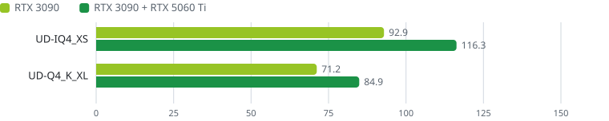
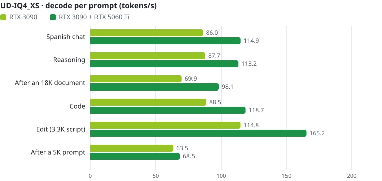
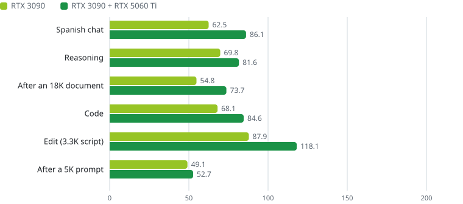
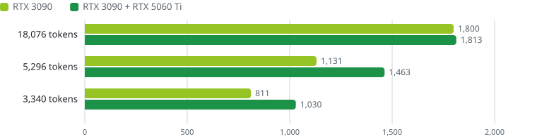
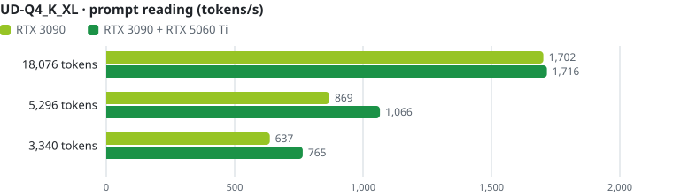
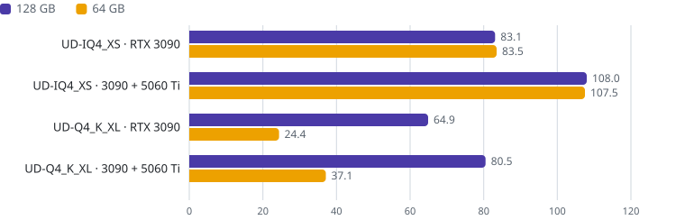
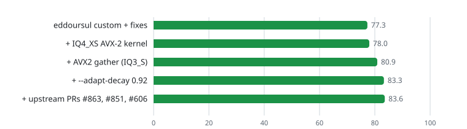
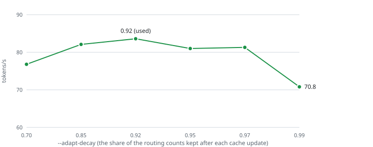
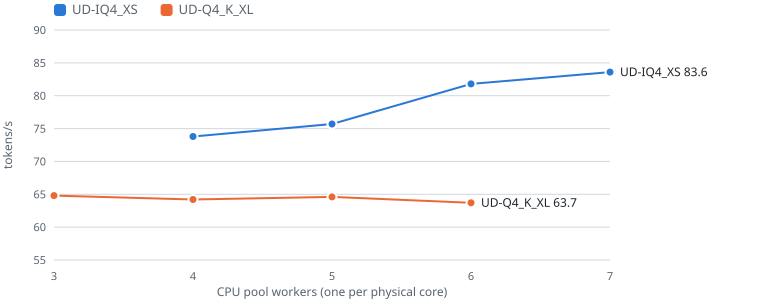

<h1 align="center">Strata on a Ryzen 7 5700X + RTX 3090 + RTX 5060 Ti</h1>

<b>Qwen3.8-Flash-Next 125B (MoE) on a desktop PC: 83 tokens/s on one RTX 3090, 108 tokens/s with an RTX 5060 Ti beside it</b> 
unsloth UD-IQ4_XS and UD-Q4_K_XL · 128 GB DDR4 · Linux · <a href="README.es.md">en español</a>

This is [eddoursul/Strata](https://github.com/eddoursul/Strata)'s `custom` branch, a fork of
[Niko1221/Strata](https://github.com/Niko1221/Strata) tuned for an RTX 3090 with a second card as an expert tier,
plus a few fixes and some of upstream's newer engine changes, measured on one machine with one GPU and with two.
The original Strata README (what Strata is, setup, every option) is in [STRATA-README.md](STRATA-README.md).

<picture>
  <source media="(prefers-color-scheme: dark)" srcset="docs/media/readme/summary-dark.svg">
  
</picture>

| Decode, tokens/s | RTX 3090 | RTX 3090 + RTX 5060 Ti | with the second GPU |
|---|---:|---:|---:|
| UD-IQ4_XS | **83.1** | **108.0** | +30% |
| UD-Q4_K_XL | **64.9** | **80.5** | +24% |

## The machine

| | |
|---|---|
| CPU | AMD Ryzen 7 5700X: 8 cores / 16 threads, Zen 3, AVX2 (no AVX-512) |
| RAM | 128 GB DDR4-3200 CL22 (4 x 32 GB), ~36 GB/s read (STREAM) |
| Main GPU | NVIDIA RTX 3090 24 GB, PCIe 4.0 x8, power limit 250 W |
| Second GPU (expert tier) | NVIDIA RTX 5060 Ti 16 GB, PCIe 4.0 x8, power limit 150 W |
| Disk | NVMe, Crucial P3 Plus 2 TB |
| Software | Linux (kernel 7.2), NVIDIA driver 615.71, CUDA 13.4, engine built for `86;120` |

At the cards' stock limits (350 W and 180 W) the speeds were the same: the engine is bound by the CPU, the RAM and
PCIe, not by the GPUs' power.

## The models

Qwen3.8-Flash-Next has 48 layers of 512 routed experts. Strata keeps the experts in RAM, keeps the most used ones in
VRAM (an adaptive cache) and computes the rest on the CPU, so the RAM, the CPU and the PCIe link all set the speed.

| | UD-IQ4_XS | UD-Q4_K_XL |
|---|---|---|
| unsloth GGUF files | 3 | 4 |
| Expert weights | 55.4 GiB | 71.7 GiB |
| Expert formats (gate/up · down) | IQ3_S (47 layers), IQ4_XS (1) · IQ4_NL (43), Q8_0 (5) | Q4_K (47), Q5_K (1) · Q5_1 (43), Q8_0 (5) |
| RAM taken by the engine | ~58 GiB | ~81 GB |
| The CPU's expert kernels | compute-bound: they scale with cores | bandwidth-bound: DDR4 saturates at ~4 cores |

Both run with 200,192 tokens of context, an int8 KV cache, the MTP draft layer with a Spanish draft vocabulary plus
prompt lookup, and greedy verification: the speculation never changes the output.

## One GPU or two

The RTX 5060 Ti holds ~14.5 GB more experts and computes its share of each layer while the CPU computes its own.

<picture>
  <source media="(prefers-color-scheme: dark)" srcset="docs/media/readme/decode-iq4xs-dark.svg">
  
</picture>

<picture>
  <source media="(prefers-color-scheme: dark)" srcset="docs/media/readme/decode-q4kxl-dark.svg">
  
</picture>

Reading the prompt (prefill) gains from the second GPU on short prompts; an 18K prompt is bound by the 3090's x8 link
either way.

<picture>
  <source media="(prefers-color-scheme: dark)" srcset="docs/media/readme/prefill-iq4xs-dark.svg">
  
</picture>

<picture>
  <source media="(prefers-color-scheme: dark)" srcset="docs/media/readme/prefill-q4kxl-dark.svg">
  
</picture>

UD-IQ4_XS is the faster of the two here (+28% on one GPU, +34% on two): its experts are smaller, so more of them fit
in VRAM (81% / 89% cache hits against 78% / 83%), and its compute-bound CPU kernels use all seven workers.
UD-Q4_K_XL is the larger, higher-precision quant.

## With 64 GB of RAM

The same PC with the engine limited to 60 GiB (what a 64 GB PC leaves free), its file cache included, by a cgroup.
UD-IQ4_XS still fits and runs at the same speed. UD-Q4_K_XL does not (71.7 GiB of experts): it reads them from the
NVMe through `--mmap-experts` and loses more than half of its speed.

<picture>
  <source media="(prefers-color-scheme: dark)" srcset="docs/media/readme/ram64-dark.svg">
  
</picture>

| 64 GB of RAM | Decode | Prefill 18K / 5K / 3K | Cache hits |
|---|---:|---:|---:|
| UD-IQ4_XS, RTX 3090 | 83.5 | 1,790 / 1,132 / 813 | 81% |
| UD-IQ4_XS, both cards | 107.5 | 1,804 / 1,460 / 1,033 | 89% |
| UD-Q4_K_XL, RTX 3090 | 24.4 | 432 / 154 / 133 | 54% |
| UD-Q4_K_XL, both cards | 37.1 | 532 / 195 / 155 | 78% |

With 64 GB, UD-IQ4_XS is the one to run; UD-Q4_K_XL needs a 96 GB PC or more (~81 GB for the engine plus the system).

## Long agent sessions

18 turns through `serve/server.py` as a coding agent would send them: pasted source files, docs, topic changes, the
conversation growing to ~31K tokens, 600 tokens per answer. On one GPU: **UD-IQ4_XS 77.8 tok/s**, UD-Q4_K_XL
59.7 tok/s (three and two runs).

## What the changes on top of eddoursul's `custom` gave

<picture>
  <source media="(prefers-color-scheme: dark)" srcset="docs/media/readme/steps-dark.svg">
  
</picture>

- The **IQ4_XS AVX-2 multi-token kernel** (upstream #415): the one IQ4_XS layer no longer goes token by token.
- The **AVX2 gather of the IQ3_S grid** (upstream, `STRATA_IQ256_GATHER=1`): bit-exact, +4.9% on Zen 3. It is
  opt-in upstream because the gather's speed depends on the CPU.
- **`--adapt-decay 0.92`** (upstream's option; 0.7 by default): the VRAM cache remembers which experts were used for
  longer. In the agent sessions the three steps gave 75.0 -> 77.8 (+3.7%).

<picture>
  <source media="(prefers-color-scheme: dark)" srcset="docs/media/readme/decay-dark.svg">
  
</picture>

Past 0.97 the cache stops following the text. With the second GPU 0.92 cancels the gather's gain, and on UD-Q4_K_XL
it gives nothing in the agent sessions, so those configs keep 0.7.

The fixes, proposed to eddoursul/Strata: the dual-GPU lockup fix of #2 by FlareP1 and
[a follow-up](https://github.com/eddoursul/Strata/pull/2) for the cache freeze it causes with 6+ pool workers;
`--mmap-experts` for native packs ([#5](https://github.com/eddoursul/Strata/pull/5)); one pool worker per physical
core on Linux ([#6](https://github.com/eddoursul/Strata/pull/6)); the engine exiting right after `QUIT`
([#7](https://github.com/eddoursul/Strata/pull/7)); the Spanish draft vocabulary
([#8](https://github.com/eddoursul/Strata/pull/8)).

## CPU pool workers

<picture>
  <source media="(prefers-color-scheme: dark)" srcset="docs/media/readme/workers-dark.svg">
  
</picture>

UD-IQ4_XS's experts are expensive to decode (codebook lookups, ~5 GB/s per core), so every core helps up to all
seven the CPU can give (one is the engine's host thread). UD-Q4_K_XL's are cheap to decode and four cores already
read the RAM as fast as it goes. Measured before the upstream ports and the final tuning; the shape is the same.

## Settings and how to run

| | UD-IQ4_XS 1 GPU | UD-IQ4_XS 2 GPUs | UD-Q4_K_XL 1 GPU | UD-Q4_K_XL 2 GPUs |
|---|---:|---:|---:|---:|
| `--pool-workers` | 7 | 7 | 4 | 4 |
| `--adapt-swaps` | 192 | 192 | 96 | 96 |
| `--adapt-decay` | 0.92 | 0.7 | 0.7 | 0.7 |
| `STRATA_IQ256_GATHER` | 1 | 1 | - | - |
| `--pcie-frac` (kernel) | 0 | 0 | 0.3 | 0 |

The four configs and the steps to build and run them on Linux: [examples/r7-5700x](examples/r7-5700x/).

## How it was measured

- Six fixed prompts, mostly in Spanish: a chat question (400 tokens out), a reasoning problem (700, thinking on), an
  18,076-token document to summarize (400), a coding task (600), a 3,340-token script returned edited (~2,600) and a
  5,296-token prompt (256). The long texts are private notes and are not published.
- The engine driven through its own `--serve` protocol, prompt cache off, greedy, speculation on. Decode speed is the
  geometric mean of the six prompts; each config is the mean of one to six runs (within 3% of each other, except one
  dual run at -3%), interleaved with the baseline when comparing builds.
- Full tables: [docs/MEASUREMENTS.md](docs/MEASUREMENTS.md).
